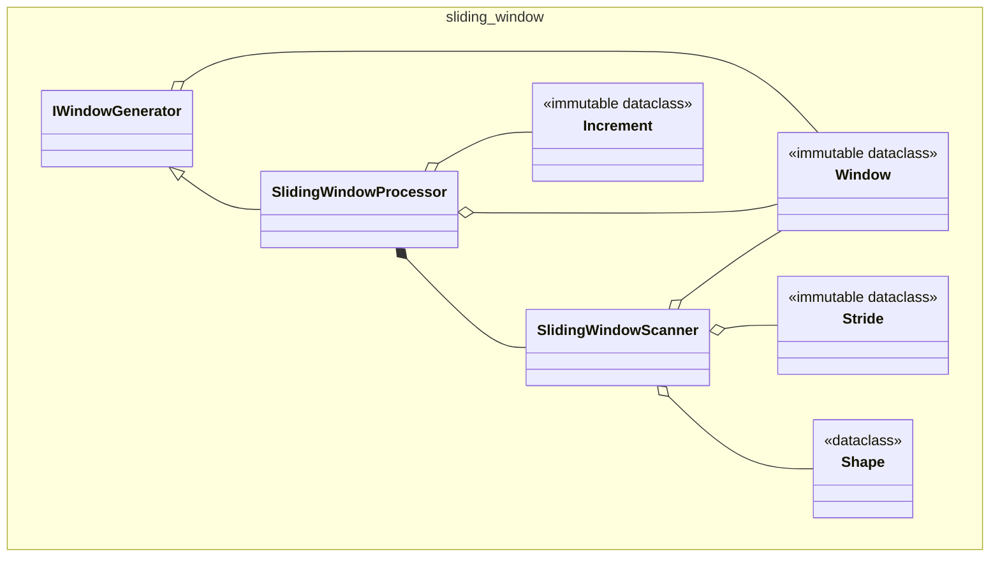
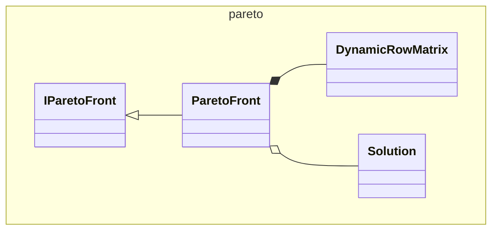
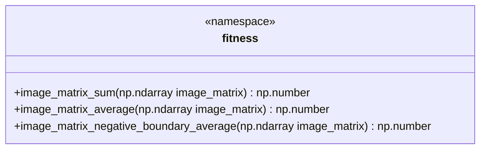
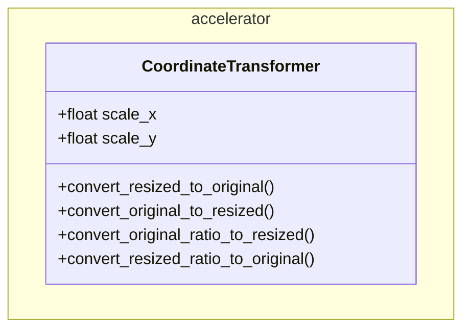
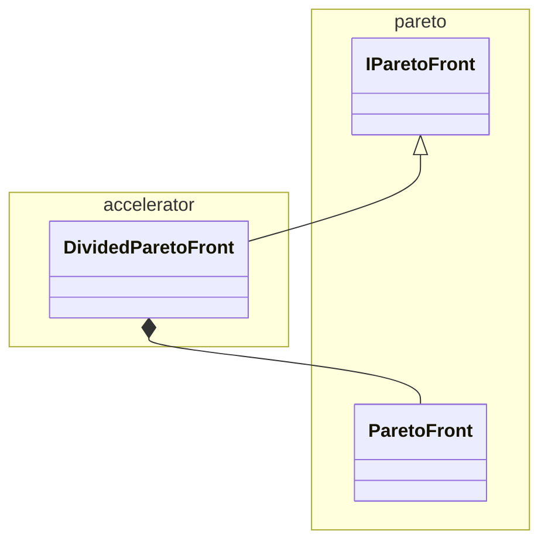
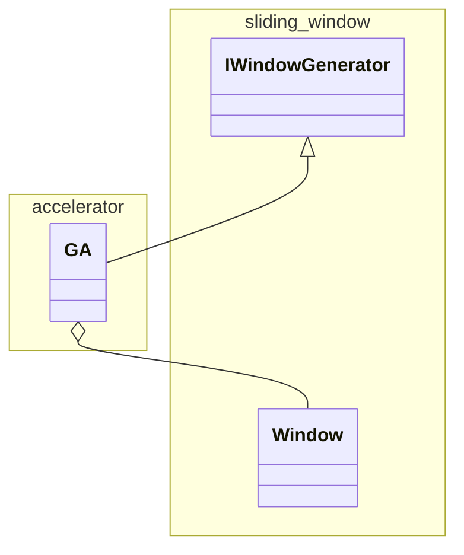

# Text2Focus

Text2Focus automatically crops images based on textual descriptions, highlighting key areas.

## 1. Introduction and Features

Text2Focus is a tool designed to automatically crop images, focusing on the most important areas based on both the content of the image and user-defined textual prompts. It is especially useful for tasks that require emphasizing specific features or regions of an image.

### Key Features:

- **Text-Based Focus**: Simply enter a text description (e.g., "human face," "cartoon character," "dog") to guide the algorithm in determining the most relevant regions to focus on. The image is then cropped to highlight these areas based on the user’s input.

- **Automatic Cropping**: After identifying the key areas in the image, the tool automatically performs the crop, ensuring the final output showcases only the most important parts of the image.

- **Multi-Objective Optimization**: The cropping process is not based on a single criterion. The algorithm takes into account several factors (like the number of key points, the proportion of the crop, and how well it captures important features) to determine the best crop that balances all these considerations.

## 2. Algorithm Explanation

### Overview

Text2Focus operates in a two-step process:

1. **Identifying Key Areas**: The algorithm identifies the most important regions of the image by combining the image’s inherent features with the user-provided text description.

2. **Optimizing the Crop**: Once the key areas are identified, the algorithm optimizes the crop, taking multiple factors into account to determine the most balanced and relevant cropped region.

### Identifying Key Areas

The first step of the process involves detecting the most important parts of the image. This is done by combining two models:

- **Pyramid (Saliency Detection)**: Pyramid \[1\]\[2\] identifies areas of the image that are visually prominent. It creates a mask highlighting these key regions.

- **OWLv2 (Text-Conditioned Object Detection)**: OWLv2 \[3\]\[4\] uses the textual prompt provided by the user (e.g., "face," "dog") to detect specific objects or areas in the image that match the description.

Both the saliency mask from Pyramid and the object detection mask from OWLv2 are combined to create a comprehensive mask representing the key regions that should be highlighted in the image.

### Optimizing the Crop

Optimizing the crop is a critical step because it involves balancing multiple factors that contribute to what is considered a "good" crop.

Different users may have different priorities (e.g., more key points, better visual balance, etc.), and a single objective cannot cover all of these preferences effectively.

This is why **multi-objective optimization** is used—it allows the algorithm to consider several competing factors at once and find the most balanced crop based on the user's needs.

The algorithm evaluates different cropping options using **multi-objective optimization**, balancing the following objectives:

1. **Total Key Points**: The crop should contain as many of the important regions as possible, ensuring that the most relevant features of the image are preserved.

2. **Proportion of Key Area**: The crop should aim to maximize the proportion of key areas within the selected region. It may conflict with **Total Key Points**, which could reduce the proportion.

3. **Inclusion of Important Features**: The crop must ensure that significant areas (like faces or objects) are fully captured without cutting them off or leaving them out of the frame.

To optimize the crop, the algorithm evaluates these different objectives using **Pareto Front Optimization**. This method helps the algorithm find the "best" crop by balancing these different factors.

A Pareto optimal solution means that no crop can improve in one aspect (e.g., more key points) without losing in another (e.g., proportion of key areas or inclusion of important features).

The user can adjust the weight of each factor to select the most suitable solution from the Pareto Front Optimization set, allowing for customized cropping based on their preferences.

This ensures that the final crop is tailored to the user’s priorities, choosing from a set of optimal, non-dominated solutions.

## 3. Implementation Details

### 3.1. Containers Interaction

- Explanation of how different containers interact with each other in the algorithm.

### 3.2. Main Component Details

- An overview of what main component inside the containers does and how they contribute to the algorithm's logic.

### 3.3. Optimization Techniques

#### 3.3.1 memory share

#### 3.3.2 Optimization Tools

- Describe any performance optimizations or accelerations that are utilized, such as caching, parallelism, etc.

## 4. Testing & Deployment

- Overview of testing strategies (unit tests, integration tests, etc.)
- Instructions on how to deploy. install and set up the project.

## 5. Usage Guidelines

- Recommendations for how to use the algorithm.
- When to replace components or customize certain parts depending on the use case.

## 6. Contributing

- Instructions for how others can contribute to the project (e.g., opening issues, submitting pull requests).

## 7. future work

- Potential future improvements or extensions of the algorithm.

## 8. License

- Information about the project’s license.

## 9. References

[1] Zhao, Ting, and Xiangqian Wu. "Pyramid feature attention network for saliency detection." Proceedings of the IEEE/CVF conference on computer vision and pattern recognition. 2019.

[2] Sairajk. PyTorch Pyramid Feature Attention Network for Saliency Detection. GitHub, n.d., https://github.com/sairajk/PyTorch-Pyramid-Feature-Attention-Network-for-Saliency-Detection.

[3] Minderer, Matthias, Alexey Gritsenko, and Neil Houlsby. "Scaling open-vocabulary object detection." Advances in Neural Information Processing Systems 36 (2024).

[4] Google. OWL-ViT 2 Base Patch 16 Ensemble. Hugging Face, n.d., https://huggingface.co/google/owlv2-base-patch16-ensemble.
