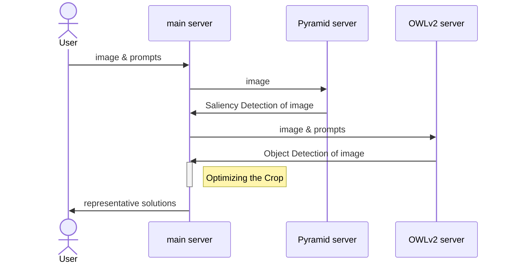
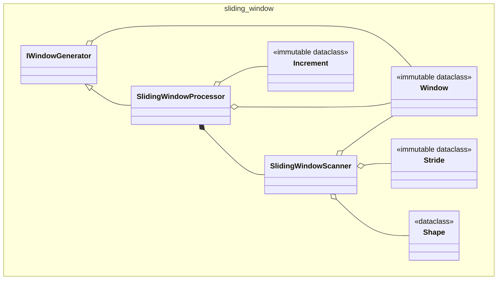
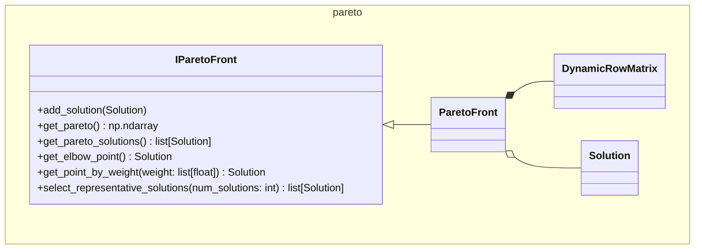
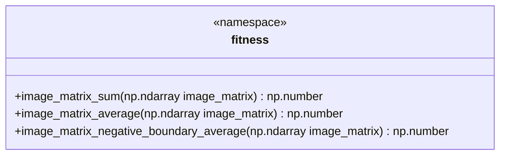
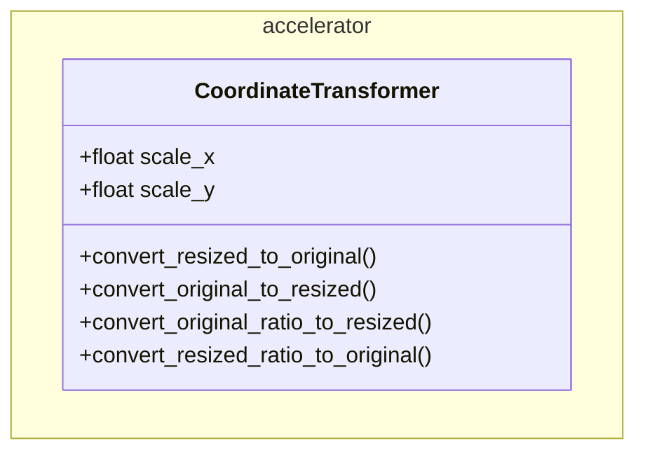
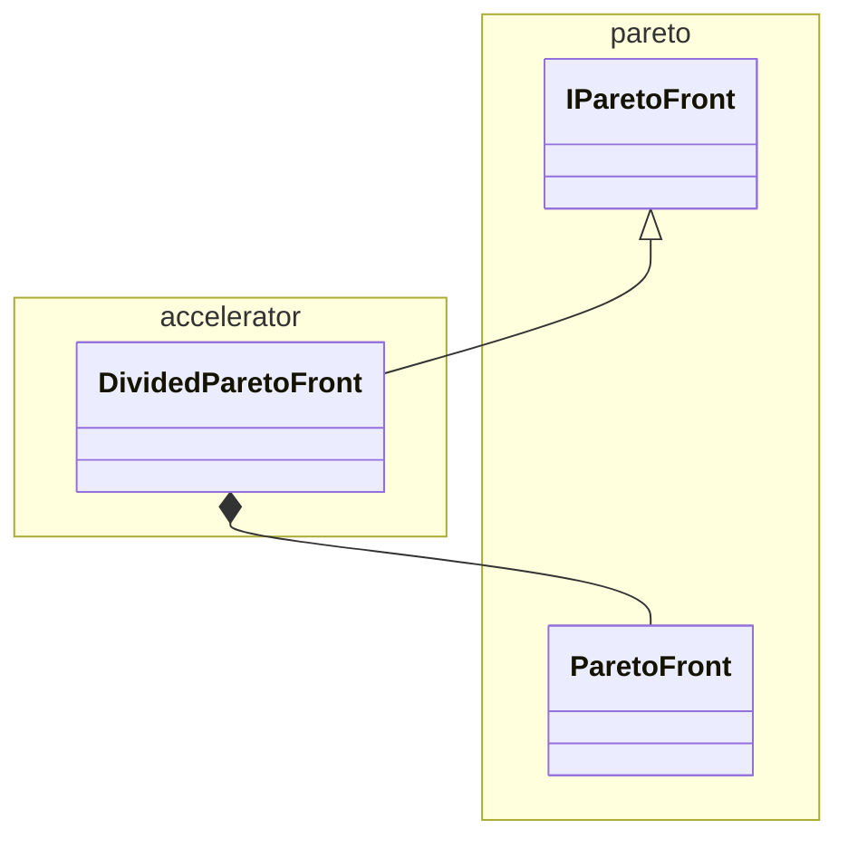
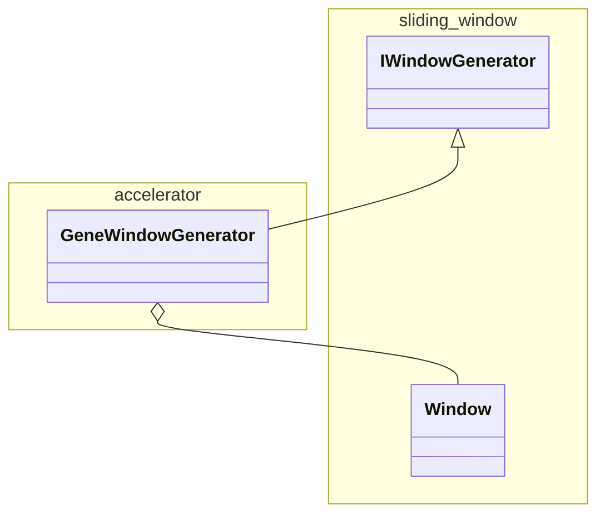

# Text2Focus

Text2Focus automatically crops images based on textual descriptions, highlighting key areas.


The test images used in this project were captured from a game called Infinity Nikki \[1\].

## 1. Introduction and Features

Text2Focus is a tool designed to automatically crop images, focusing on the most important areas based on both the content of the image and user-defined textual prompts. It is especially useful for tasks that require emphasizing specific features or regions of an image.

### Key Features:

- **Text-Based Focus**: Simply enter a text description (e.g., human face, cartoon character, dog) to guide the algorithm in determining the most relevant regions to focus on. The image is then cropped to highlight these areas based on the user’s input.

- **Automatic Cropping**: After identifying the key areas in the image, the tool automatically performs the crop, ensuring the final output showcases only the most important parts of the image.

- **Multi-Objective Optimization**: The cropping process is not based on a single criterion. The algorithm takes into account several factors (like the number of key points, the proportion of the crop, and how well it captures important features) to determine the best crop that balances all these considerations.

## 2. Algorithm Explanation

### Overview

Text2Focus operates in a two-step process:

1. **Identifying Key Areas**: The algorithm identifies the most important regions of the image by combining the image’s inherent features with the user-provided text description.

2. **Optimizing the Crop**: Once the key areas are identified, the algorithm optimizes the crop, taking multiple factors into account to determine the most balanced and relevant cropped region.

### Identifying Key Areas

The first step of the process involves detecting the most important parts of the image. This is done by combining two models:

- **Pyramid (Saliency Detection)**: Pyramid \[2\]\[3\] identifies areas of the image that are visually prominent. It creates a mask highlighting these key regions.


- **OWLv2 (Text-Conditioned Object Detection)**: OWLv2 \[4\]\[5\] uses the textual prompt provided by the user (e.g., "face," "dog") to detect specific objects or areas in the image that match the description.


Both the saliency mask from Pyramid and the object detection mask from OWLv2 are combined to create a comprehensive mask representing the key regions that should be highlighted in the image.


### Optimizing the Crop

Optimizing the crop is a critical step because it involves balancing multiple factors that contribute to what is considered a "good" crop.

Different users may have different priorities (e.g., more key points, better visual balance, etc.), and a single objective cannot cover all of these preferences effectively.


This is why multi-objective optimization is used—it allows the algorithm to consider several competing factors at once and find the most balanced crop based on the user's needs.

The algorithm evaluates different cropping options using multi-objective optimization, balancing the following objectives:

1. **Total Key Area**: The crop should contain as many of the important regions as possible, ensuring that the most relevant features of the image are preserved.

2. **Proportion of Key Area**: The crop should aim to maximize the proportion of key areas within the selected region. It may conflict with Total Key Points, which could reduce the proportion.

3. **Avoidance of Cutting Key Areas**: The crop should ensure that important areas (such as faces or key objects) are not cut off or excluded from the frame, even if they are not fully included within the crop.

To optimize the crop, the algorithm evaluates these different objectives using Pareto Front Optimization. This method helps the algorithm find the "best" crop by balancing these different factors.


The front pareto image from wiki \[6\].

A Pareto optimal solution means that no crop can improve in one aspect (e.g., more key points) without losing in another (e.g., proportion of key areas or inclusion of important features).

The user can adjust the weight of each factor to select the most suitable solution from the Pareto Front Optimization set, allowing for customized cropping based on their preferences.

This ensures that the final crop is tailored to the user’s priorities, choosing from a set of optimal, non-dominated solutions.


## 3. Implementation Details

### Containers Interaction

The algorithm is divided into three Docker containers based on functionality. Each container performs its respective computation, and communication is carried out through HTTP protocols.



For detailed container setup, please refer to the [docker-compose.yml](https://github.com/avengerandy/Text2Focus/blob/master/docker-compose.yml) file for more information.

### Main Component Details

* `sliding_window`

This module provides a set of classes and methods designed for performing sliding window operations on an image matrix. The primary purpose of this module is to allow users to extract sub-matrices (or windows) from a larger image matrix in a controlled and systematic way, using customizable window sizes, strides, and dynamic resizing.



The core functionality revolves around the concept of a sliding window, which moves across the image in steps, both horizontally and vertically, based on the defined stride. The `Shape` class defines the initial size of the window, and the `Stride` class controls how far the window moves at each step. Additionally, the window size can be incrementally increased after each pass, allowing the user to perform scans with progressively larger windows.

The module also introduces two main implementations of the `IWindowGenerator` interface, which is responsible for generating the sliding windows:

1. SlidingWindowScanner: This class generates sliding windows over the image matrix based on the defined window shape and stride. It scans the image in a straightforward manner without altering the window size between scans. Once the window reaches the end of the image matrix, it stops.

2. SlidingWindowProcessor: This class builds on the functionality of `SlidingWindowScanner` but introduces dynamic resizing. It allows the window to expand after each scan by a specified increment, meaning that the window size will increase with each pass, enabling the extraction of sub-matrices at varying levels of granularity.

In summary, both `SlidingWindowScanner` and `SlidingWindowProcessor` implement the `IWindowGenerator` interface, but the key difference is that `SlidingWindowProcessor` incorporates dynamic window expansion by adjusting the window size after each scan, whereas `SlidingWindowScanner` keeps the window size fixed throughout.

* `pareto`

This module provides tools for managing Pareto front solutions in multi-objective optimization problems. It includes several classes for storing, updating, and filtering solutions, with the core functionality focused on managing the Pareto front — eliminating dominated solutions and selecting the best ones based on different criteria.



The `Solution` class represents a single solution with associated values (e.g., objective values) and optional metadata. It provides methods to check if one solution is dominated by another and to retrieve its values and metadata.

The `DynamicRowMatrix` class is used to dynamically resize a matrix that stores solutions, expanding it as needed when new solutions are added. This class helps efficiently manage the growing number of solutions during optimization.

The `IParetoFront` interface defines the essential operations for handling Pareto fronts, such as adding solutions, retrieving Pareto optimal solutions, and selecting representative solutions based on specific criteria like clustering or a weight vector.

The `ParetoFront` class implements the `IParetoFront` interface and provides functionality to maintain and analyze the Pareto front. It supports adding solutions, retrieving Pareto optimal solutions, selecting solutions based on different criteria (e.g., the elbow point or weighted solutions), and even selecting representative solutions using clustering techniques like KMeans.

In summary, this module offers a robust framework for managing Pareto fronts in multi-objective optimization problems, allowing for the efficient addition, analysis, and selection of solutions based on various optimization criteria.

* `fitness`

This module contains a set of fitness functions used to evaluate the quality of an image matrix.



By combining these tools:

1. the `sliding_window` module generates solutions
2. the `fitness` module evaluates them
3. the `pareto` module filters and assesses the solutions based on Pareto optimality

They provide the foundational operations needed for the program to function. The following sections will introduce advanced techniques to accelerate these processes and optimize performance.

### Optimization Techniques

#### memory share

In the algorithm, memory is optimized by using references to portions of the matrix, avoiding unnecessary memory duplication.

For example, in the `SlidingWindowScanner`, the `generate_windows` method slices the image matrix instead of creating copies:

```python
class SlidingWindowScanner:
    def generate_windows(self) -> Generator[Window, None, None]:
        for i in range(0, width - window_width + 1, horizontal_stride):
            for j in range(0, height - window_height + 1, vertical_stride):
                sub_image_matrix = self.image_matrix[
                    j : j + window_height, i : i + window_width
                ]
                yield Window(sub_image_matrix=sub_image_matrix, i=i, j=j, ...)
```

Here, sub_image_matrix is just a reference to a section of the original image_matrix, reducing memory overhead by avoiding data duplication.

This reference-based approach also ensures that the SlidingWindowProcessor, which dynamically adjusts the window size and frequently generates new windows, doesn't consume excessive resources when creating multiple matrices.

> Warning: When modifying or extending this code, it's important to remember that many operations in this project rely on shared memory references at the lower level. This practice is common throughout the project, and improper handling could lead to unexpected behavior or excessive memory usage.

#### Optimization Tools

* `CoordinateTransformer`

This class is used to handle the coordinate transformation issues that arise when resizing images.



Since key area extraction doesn't require extremely high resolution, it is common practice to downscale images to speed up the process. This tool's main purpose is to provide the conversion between coordinates in the original image and the resized image.

Whether converting the coordinates from the resized image back to the original size, or transforming the original size's ratio to fit the resized version, `CoordinateTransformer` ensures that the system can work efficiently with different image sizes while maintaining accurate positioning.

* `DividedParetoFront`

This class utilizes a divide-and-conquer strategy to manage the large number of solutions that may arise in the multi-objective optimization process.



By breaking down the problem into multiple smaller Pareto Fronts, this tool reduces the exponential growth of the solution space, making the process more time-efficient.

This method helps maintain a manageable number of solutions to evaluate, preventing performance bottlenecks and optimizing the decision-making process by handling multiple Pareto fronts.

* `GeneWindowGenerator`

This class is a window generator that uses genetic algorithms to generate solutions.



It applies operations such as random window generation, crossover, and mutation to create various windows. Essentially, this tool is a simplified version of the NSGA-II [8] multi-objective genetic algorithm, which can be used to generate window configurations with optimized properties.

While the full NSGA-II could potentially provide higher-quality results, the simplified version is often sufficient for many tasks and provides an efficient way to generate good solutions without excessive computational cost.

## 4. Testing & Deployment

### 4.1 Docker Compose Deployment

The system is divided into three main components: `owlv2`, `pyramid`, and the main crop optimization logic. These are managed via `docker-compose`.

To start all services:

```bash
docker compose up --build
```

This will launch the following containers:

* `owlv2-container` – zero-shot object detection
* `pyramid-container` – saliency detection
* `pytorch-container` – main algorithm logic

All services communicate through internal HTTP APIs.

> Note: By default, each container uses `pytorch/pytorch:2.5.1-cuda12.1-cudnn9-runtime` as the base image. You may freely change this base image depending on your system setup (e.g., different CUDA versions, or CPU-only environments). GPU support is optional but recommended for best performance.

### 4.2 OWLv2 Service

The OWLv2 service automatically downloads its model weights from Hugging Face on first run. Once launched, it immediately starts the object detection server.

You can verify that the OWLv2 service is working correctly by running:

```bash
python test_integration.py
```

inside the container. This script will send a test image to the server and validate the output mask.

### 4.3 Pyramid Service

The Pyramid service also downloads some model weights from Hugging Face on first run. However, **some checkpoints must be manually downloaded** from the [official repository](https://github.com/sairajk/PyTorch-Pyramid-Feature-Attention-Network-for-Saliency-Detection) \[3\].

Before running the container:

1. Download the checkpoint from the official repository \[3\].
2. Place the checkpoint file in the `pyramid/` directory.
3. Make sure the checkpoint file is accessible inside the container, not just on the host.
4. Update the `MODEL_PATH` variable in `pyramid/server.py` to match your local checkpoint path and filename.

Once launched, it immediately starts the saliency detection server.

You can verify that the Pyramid service is working correctly by running:

```bash
python test_integration.py
```

inside the container. This script will send a test image to the server and validate the output mask.

### 4.4 Main Algorithm Logic

**TODO**

This container hosts the core crop optimization logic and coordinates requests to the Pyramid and OWLv2 services.

## 5. Usage Guidelines

### Recommendations for how to use the algorithm.

Zero-shot object detection sounds intelligent, but in practical applications, it might just be a fancy feature. The reason for this is that the performance of zero-shot detection is usually lower than algorithms specifically trained to detect certain objects.

There are a few situations users should be aware of:

* **If the object you're detecting is common** (e.g., car, human, etc.), it is highly likely that there is already a pre-existing dataset (e.g., COCO) and pre-trained models available that you can use. In this case, you don't need to rely on OWLv2.

* **If the object you're detecting is uncommon**, but you have image data available, you can consider using OWLv2 as a tool to assist in annotating your data, and then train a specialized model. For example, you can train a model like [Anime Face Detector](https://github.com/qhgz2013/anime-face-detector), a Faster-RCNN-based anime face detector \[7\].

* **Only if you completely lack a dataset**, or if your use case involves unpredictable detection needs (e.g., letting users decide what to detect), should you consider using OWLv2 for zero-shot object detection.

### When to replace components or customize certain parts depending on the use case.

In the algorithm, there are some acceleration tools that you should consider using based on the use case:

#### CoordinateTransformer

- **CoordinateTransformer** is used for scaling images. This is almost mandatory because larger images consume more resources. Always use this to ensure the image is properly scaled before processing.

#### Crop Mode


- **Precise Crop Mode** involves using `SlidingWindowProcessor`, a brute-force method that scans all possible solutions. This results in many potential solutions, so it's recommended to use `DividedParetoFront` for acceleration. This helps speed up the processing without losing accuracy. You can check `SlidingFocusTemplate` in `template.py` for more details.

- **Approximation Crop Mode**

1. Uses `GeneWindowGenerator` to generate approximate solutions within a fixed time frame. Since the genetic algorithm produces fewer solutions, `ParetoFront` can be used directly without the need for additional acceleration. You can check `GeneFocusTemplate` in `template.py` for more details.

2. Uses `NSGA2WindowGenerator`, which implements a more advanced genetic algorithm based on NSGA-II. This method strikes a balance between precision and performance—typically achieving more accurate results than `GeneWindowGenerator` while being faster than `SlidingWindowProcessor`. You can check `NSGA2FocusTemplate` in `template.py` for more details.

You can refer to the figure below, which shows the PR (Percentile Rank) of `GeneWindowGenerator` compared to `SlidingWindowProcessor` in terms of accuracy and execution time. To reproduce the experiment, please refer to the code in the `experiment` folder.


#### Fill Mode


- **Fill Mode** is similar to CSS's `cover`, which stretches the image to cover the entire container while maintaining the aspect ratio. In this case, you can use `SlidingWindowScanner`. Technically, multi-objective optimization is not strictly necessary for this mode, since the goal is inherently geometric. However, to maintain a consistent interface across different modes, the implementation still evaluates three objective dimensions and returns a ParetoFront. You can check `ScannerFocusTemplate` in `template.py` for more details.

#### Conclusion

| Mode | IWindowGenerator | IParetoFront |
|------|------------------|--------------|
| Precise Crop Mode (Slower) | SlidingWindowProcessor | DividedParetoFront |
| Approximation Crop Mode (Faster) | GeneWindowGenerator | ParetoFront |
| Fill Mode (Special Case) | SlidingWindowScanner | None |

## 6. License

This project is licensed under the MIT License. See the [LICENSE](https://github.com/avengerandy/Text2Focus/blob/master/LICENSE) file for more details.

## 7. References

[1] Infold Games. Infinity Nikki Official Website – The Coziest Open-World Game. Infinity Nikki Official Website, n.d., https://infinitynikki.infoldgames.com/en/home.

[2] Zhao, Ting, and Xiangqian Wu. "Pyramid feature attention network for saliency detection." Proceedings of the IEEE/CVF conference on computer vision and pattern recognition. 2019.

[3] Sairajk. PyTorch Pyramid Feature Attention Network for Saliency Detection. GitHub, n.d., https://github.com/sairajk/PyTorch-Pyramid-Feature-Attention-Network-for-Saliency-Detection.

[4] Minderer, Matthias, Alexey Gritsenko, and Neil Houlsby. "Scaling open-vocabulary object detection." Advances in Neural Information Processing Systems 36 (2024).

[5] Google. OWL-ViT 2 Base Patch 16 Ensemble. Hugging Face, n.d., https://huggingface.co/google/owlv2-base-patch16-ensemble.

[6] Nojhan - Own work, CC BY-SA 3.0, https://commons.wikimedia.org/w/index.php?curid=770240

[7] Qhgz2013. Anime Face Detector: A Faster-RCNN based anime face detector. GitHub, n.d., https://github.com/qhgz2013/anime-face-detector.

[8] Deb, Kalyanmoy, et al. "A fast and elitist multiobjective genetic algorithm: NSGA-II." IEEE transactions on evolutionary computation 6.2 (2002): 182-197.
